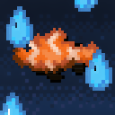

# Catch the Rainbow



> A Minecraft mod that makes fish swim in the rain, including the drowned.

**When it rains, water is in the air. Literally.** The whole mod is one
idea: **rain = water.** While it rains, fish in the water remember that
the sky is just more water, and they come up to swim through it — never
more than 10 blocks above the ground. It also rains fish: biome-aware
spawns drop from the clouds near you (warm oceans rain tropical fish and
pufferfish, cold oceans rain cod and salmon, capped around 40). When the
rain stops, gravity remembers too.

On rainy nights the drowned spawn right out of the rain overhead — some
riding zombie nautiluses. And every so often the rain sends something
worse: **the Dolphin Knight**, a drowned with a diamond spear riding a
dolphin. It circles like a shark, dives with real pathfinding (fences and
1-block gaps included), and stabs with genuine vanilla spear mechanics —
the faster it moves on impact, the harder it hits. Shoot the dolphin down
and the knight keeps coming on foot. Angrier.

## Details

- **Rain flight** for fish, squids and dolphins (modded fish tagged into
  `rain_swimmers` join automatically), up to 10 blocks above the ground
- **Rain-born fish** dropping from the sky, biome-aware via a three-tier
  thermometer: the biome's own `WATER_AMBIENT` spawner list, then the
  temperature field, then id fallback — no hardcoded biome table
- **Airborne drowned** on rainy nights: up to 4 at once on normal, 6 on
  hard, doubled during thunderstorms (which also unlock daytime spawns)
- **Dolphin Knight** with a full aerial combat AI: orbit, pathfinding
  dive, vanilla `KineticWeapon` stab (damage scales with relative impact
  speed), climb-away, repeat
- Respects the `SPAWN_MOBS` / `SPAWN_MONSTERS` gamerules

### Operator commands

```
/rainow dolphin_knight <x> <y> <z>
/rainow nautilus_knight <x> <y> <z>
```

## Versions

| Minecraft | Branch | Notes |
|---|---|---|
| 26.2 | `main` | Primary target (Fabric, Java 25) |
| 26.1.2 | — | Builds from `main` with a single rename: `EntityTypes` → `EntityType` (29 references, 2 files). Compiles cleanly otherwise. |

Server-side logic mod; installing it on the client is optional (adds a
minor pose fix for mounted riders).

## Dependencies

None required. Optional: **Fabric API** enables the operator commands
(`/rainow ...`) — without it the mod runs fine, only those commands are
absent.

## Building

Requires JDK 25 and Gradle 9.7.1+ (no wrapper is shipped):

```
gradle build
```

The jar lands in `build/libs/`.

## Credits

- Developed in human-directed AI collaboration (**GLM & DeepSeek**)
- Icon background is AI-generated; the fish is the authentic in-game texture
- Part of the inspiration: Terraria's rain-walking goldfish and the flying
  fish that hunt you in the storm
- Named after **Catch the Rainbow**, Blackmore's Stand from JoJo's
  Bizarre Adventure Part 7: *Steel Ball Run*

## License

[MIT](LICENSE) — do whatever you want, just keep the notice.
